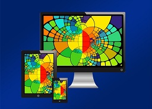

Om hemsidan
==============================================

Kuresen *Teknisk webbdesign och användbarhet* lär ut grunder i webbdesign samt
principer för användbarhet. Kursen inkluderar ämnen som färgläggning, typografi,
layout, samt olika ramverk.  

Här finns [git-repot](https://github.com/reblex/Anax-Flat) för hemsidan.
